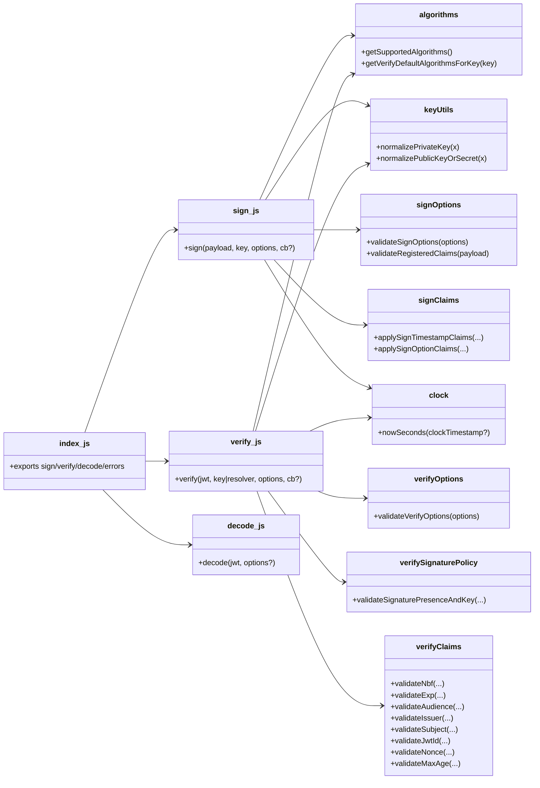

# Re-Engineering Report — JWT Implementation (`node-jsonwebtoken`)

## Deliverables

### 1) Source code of re-engineered / refactored application

- **Location**: `C:\Users\lenovo\Downloads\java-jwt-master\node-jsonwebtoken\`
- **Public API unchanged**: `index.js` continues to export `sign`, `verify`, `decode`, and the error types.

Key refactored / added modules (internal):
- `lib/algorithms.js`
- `lib/keyUtils.js`
- `lib/clock.js`
- `lib/options/sign.js`
- `lib/options/verify.js`
- `lib/claims/sign.js`
- `lib/claims/verify.js`
- `lib/policy/verifySignature.js`

### 2) Comprehensive report

This document.

## a) Design of original source code

### High-level architecture

The original codebase is structured as a small CommonJS library:
- `index.js` acts as a **module façade**, exporting:
  - `sign(payload, secretOrPrivateKey, options?, callback?)`
  - `verify(token, secretOrPublicKeyOrResolver, options?, callback?)`
  - `decode(token, options?)`
  - error constructors: `JsonWebTokenError`, `TokenExpiredError`, `NotBeforeError`

### Key design characteristics (original)
- **Procedural “pipeline” functions**:
  - `sign.js` implemented: input validation, option validation, key normalization (into `KeyObject`), algorithm/key policy checks, timestamp claim handling, claim mapping, then `jws` signing (sync/async).
  - `verify.js` implemented: option validation, token parsing, key resolution (direct or callback), key normalization, algorithm inference, `jws.verify`, then claim validation and return shaping.
- **Dependencies**:
  - `jws` for signing/verifying/decoding JWS/JWT.
  - Node `crypto` for parsing PEM/KeyObject and enforcing key type constraints.
  - `ms` via `lib/timespan.js` for timespan parsing.
  - lodash validators for input checking in signing options.

## b) Summary of design defects observed

### 1) Low cohesion (“god functions”)
Both `sign.js` and `verify.js` combined multiple responsibilities:
- validation
- key parsing/normalization
- algorithm policies/defaults
- timestamp and claim logic
- cryptographic call-out to `jws`
- sync/async orchestration and error routing

This made the code harder to reason about and riskier to change.

### 2) Duplication and scattered policy
- Algorithm lists and “default allowed algorithms” logic existed inside `verify.js`.
- Key-material normalization existed in both `sign.js` and `verify.js`.
- Unsigned-token policy (“none” algorithm rules) was embedded inside `verify.js`.

### 3) Side effects / mutation risk
The original `verify.js` cloned `options` because it was going to mutate it (notably `options.algorithms` inference). Even with cloning, the design encourages mutation and makes flow harder to follow.

### 4) Limited test seams
Because policy/validation/claim logic lived inside the large pipelines, it was difficult to test those concerns in isolation and reuse them safely.

## c) List of changes / refactorings applied

**Constraint respected**: The public API and behavior were preserved; the test suite remains green.

### Refactorings

#### 1) Extract Module — algorithms
- Added `lib/algorithms.js`:
  - centralizes supported algorithm list (including conditional PS algorithms)
  - centralizes verify’s “default allowed algorithms for key type” inference

#### 2) Extract Module — key normalization
- Added `lib/keyUtils.js`:
  - `normalizePrivateKey(...)` for signing
  - `normalizePublicKeyOrSecret(...)` for verification

#### 3) Extract Module — clock
- Added `lib/clock.js`:
  - `nowSeconds(clockTimestamp?)` used by verification and by sign-claim application.

#### 4) Extract Module — sign option/claim validation
- Added `lib/options/sign.js`:
  - `validateSignOptions(options)`
  - `validateRegisteredClaims(payload)`
  - exports `optionsToPayload` and `optionsForNonObjectPayload` used by `sign.js`

#### 5) Extract Module — sign claims application
- Added `lib/claims/sign.js`:
  - `applySignTimestampClaims(payload, isObjectPayload, options, timespan)`
  - `applySignOptionClaims(payload, options, optionsToPayload)`

#### 6) Extract Module — verify option validation
- Added `lib/options/verify.js`:
  - `validateVerifyOptions(options)` validating `clockTimestamp`, `nonce`, `allowInvalidAsymmetricKeyTypes`

#### 7) Extract Module — verify signature/unsigned-token policy
- Added `lib/policy/verifySignature.js`:
  - `validateSignaturePresenceAndKey(hasSignature, key, algorithmsOption)`
  - centralizes rules for unsigned tokens and signature/key consistency

#### 8) Extract Module — verify claim validation
- Added `lib/claims/verify.js`:
  - isolates `nbf`, `exp`, audience/issuer/subject/jwtid/nonce, and `maxAge` logic.

#### 9) Reduce mutation (verify)
- `verify.js` now uses a local derived list:
  - `const allowedAlgorithms = options.algorithms || getVerifyDefaultAlgorithmsForKey(key)`
  - rather than mutating `options.algorithms`.

## d) Improved design / class diagram and improvements achieved

### Improved module/class diagram (module-oriented)



### Improvements achieved
- **Improved cohesion**: validation, claims, key normalization, algorithm inference, and policy are in focused modules.
- **Reduced duplication**: shared algorithm/key logic is now single-sourced.
- **Clearer security policy**: unsigned-token rules live in one place (`lib/policy/verifySignature.js`).
- **Reduced side effects**: verification avoids mutating derived configuration (`options.algorithms`).
- **Maintainability and extensibility**: adding claims/options/policies now tends to be localized changes with less risk.

## Test evidence

Run from `node-jsonwebtoken/`:

```bash
npm test
```

Result (at time of refactor): **511 passing, 1 pending**.

